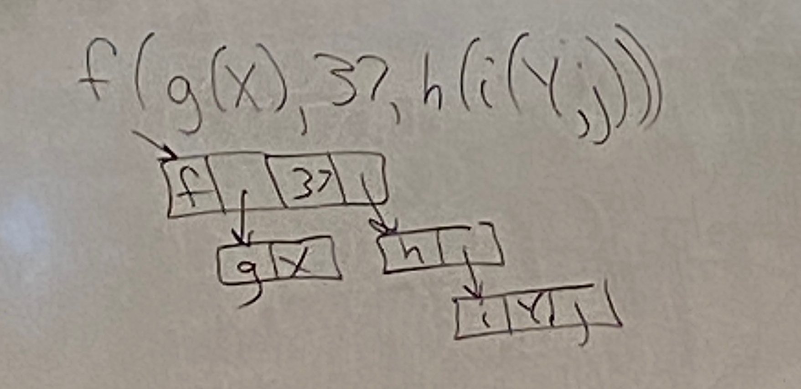
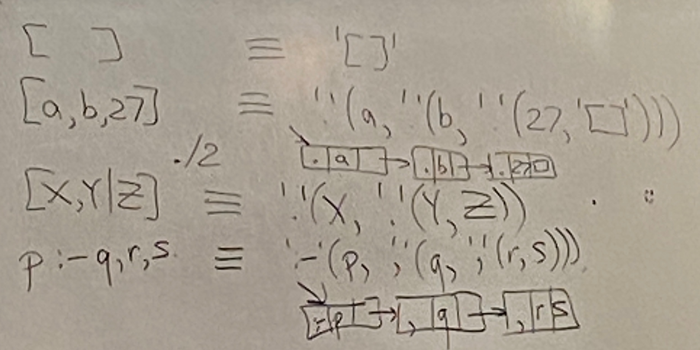

# Lecture 10

## Logic Programming
- logic: why?
```
int[] a = ...
int minv = INT_MAX
for (int i = 0; i < a.length; i++) {
    if (a[i] < minv) {
        minv = a[i];
    }
}
return minv;
```
- we need $\forall 0 \leq j < i$ and $minv \leq a[j]$ and $i < 0 \implies \exists j 0 \leq i minv = a[j]$
- Prolog
- declarative, not imperative, commands
- say what you want
- advantage is you get more freedom for the implementation
- Algorithm = Logic + Control
- (correctness + efficiency)
- :- if
- , and
- "For all L and S, if perm(L, S) and sorted(S) then sort(L, S)"
```prolog
sort(L, S) :- perm(L, S), sorted(S).
sorted([]).
sorted ([_]).
sorted([X, Y|L]) :- X =< Y, sorted([Y|L]).

perm([], []).
perm([X|L], R) :-
    perm(L, PL),
    append(PL1, PL2, PL)
    append(PL1, [X|PL2], R).

append([], L, L)
append([X|L], M, [X|LM]) :- append(L, M, LM)
```
- Another way of thinking about it is:
```prolog
perm(A, B) :- sort(A, S), sort(B, S)
? - sort([3, -5, -2, 7], Q)
Q = [-5, -2, 3, 7]
```
- O(N!)

## Core Syntax of Prolog
- Term: number
- Atom: [a-z][a-zA-Z_]* e.g. abc, q, etc.
- Variable: [A-Z][a-zA-Z_]*
- structure f(args)
- arity = number of args, >= 0
- tree structure


## Syntactic Sugar
- f(x)+g(y, z*(3-a))
- '+'(f(x), g(y, '*'(z, '-'(3, q))))

## More Syntax
- facts sorted([]).
- rules sorted([X, Y|L]) :- X =< Y, sorted(L)
- queries ?- sorted([3, -9, Z])
- above three are all clauses
- Algorithm: backward chaining
  - left to right across the DB
  - left to right across subgoals of a clause
  - depth first left to right


## Example
- member
```prolog
member(X, [X|_])
member(X, [_|L]) :-
    member(X, L)
?- member(Q, [3, -1, 7])
Q = 3;
Q = -1;
?- member(9, L)
L = [9|_27];
L = [_26, 9|_37];
L = [_32, _29, 9|_107];

?- append([a, 3], [2, c, d], R).
R = [a, 3, 2, c, d]
?- append(L, M, [a, b, c]).
L = [], M = [a, b, c];
L = [a], M = [b, c]
```

```prolog
reverse([], [])
reverse([X|L], R):-
    reverse(L, _l),
    append(_l, [X], R)
reverse(L, R) :- rev(L, [], R).
rev([], A, A).
rev([X|L], A, R) :- rev(L, [X|A], R)
```

```prolog
N is 3+4*5
```
- is(N, T) succeeds if N = term, otherwise fails
```prolog
?- K=27, N is K*K
?- N is K*K, K = 27
?- 1369 is K * K
```
