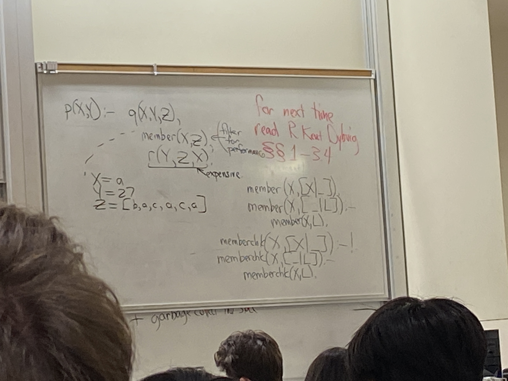

# Lecture 11

## Debugging logic programs
```java
x = f(y)
z = g(x, y)
w = z + 1
def f(a),
```
- searching through & tree

```prolog
p(X) :- q(X),write(X), nl, r(X)
p(X) :- Z(X)
q(X) :- a(X, Y), b(Y)
```
- searching through & and | tree
```prolog
?- p(Z), write(Z), nl, fail
?- true
yes
?- fail
no
```
- source code: true
- source code: (empty)
```prolog
loop :- loop
repeat.
repeat :- repeat
repbad :- repbad
repbad.
?- loop
(loop)
?- repeat, write("foo"), nl, fail
foo
foo
foo
foo
...
?- repbad, write("foo"), nl, fail
```
- since DFS, `repbad` goes into an infinite loop

## 4 port debugging model
- 2 port model
  - call, return
- 3 port model
  - call, throw, return
- call, succeed, fail, backtrack
- `?- trace` puts prolog into "chatty" mode
```prolog
?- p(A) 
call: p(A)
```

## Memory management
- conventional languages have
  - stack: call + return (LIFO)
  - heap: (LIAO)
- at first: Prolog has only a stack
  - success: stack grows
  - variables become bound to values on stack
  - fail: pop stack: (unbind variables) free storage for values
- More complex:
  - \+ garbage collect the stack

## Unification
- p(X, f(Y))
- p(g(Z), f(27))
- unifier: {X = g(27), Y = 27, Z = 27}
- an assignment of values to variables so that you make two terms equal
- prolog comes up with most general unifier

```prolog
p([], empty)
p([_], singleton)
p([x,_], x)
p([_,_,_|_], longer)
?- p(5, 2, 7, 8), R)
```

```ocaml
let f = function
| [] -> empty
| [_] -> singleton
| [x,_] -> x
| _ -> longer
```

```prolog
p([H|T], R)
T = [], R = singleton;
H = R, T = [_]
```
- pattern matching is a la ML is one way
- unification is two way
- as you succeed
  - you can bind a variable to any value
  - but the only way to change the binding is to fail

## Prof. Peano
- axioms for arithmetic
- failed
- goal: prove anything that's true about integer arithmetic
- z zero
- s(X) X + 1
- s(s(s(z))) is 3
- sum(z, X, X)
- sum(s(X), Y, s(XplusY)) :- sum(X, Y, XplusY)
- diff(A, B, C) :- sum(B, C, A)
- ?- diff()

```prolog
lt(X, s(X))
lt(X, Y) :- lt(s(X), Y)
?- lt(I, I)
I = s(s(s(s(...)))))
I = infinity
```

- for efficiency, Prolog unifies a variable to anything else cheaply (store a word)
- unify_with_errors
- basic Prolog control predicate: "cut"



suceeds BUT if you backtrack into it, calling predicate immediately fail

when you backtrack into cut, will not look into other alternatives

```prolog
once(P) :- P, !;
```

```prolog
not(P) :- P, !, fail
not(_).
?- not(member (a, [c, d, e]))
yes
?- not(member (x, [c, d, e]))
no
?- X=a, not(member(X, [c, d, e]))
X=a
?- not(member(X, [c, d, e])), X=a
no
```

- not is not really not
- "\\+" is the true name
- the "not provable" operator, not the "not" operator
- All course prereqs:
```prolog
pr(CS31, CS131)
pr(CS35L, CS131)
pr(CS131, CS132)
?- pr(dance101, cs131)
no
?- \+pr(dance101, cs131)
yes
?- \+pr(X, cs131)
no
```
- The closed world assumption: everything that is provable is true, everything that is true is provable
- when you do use it, make all terms ground terms