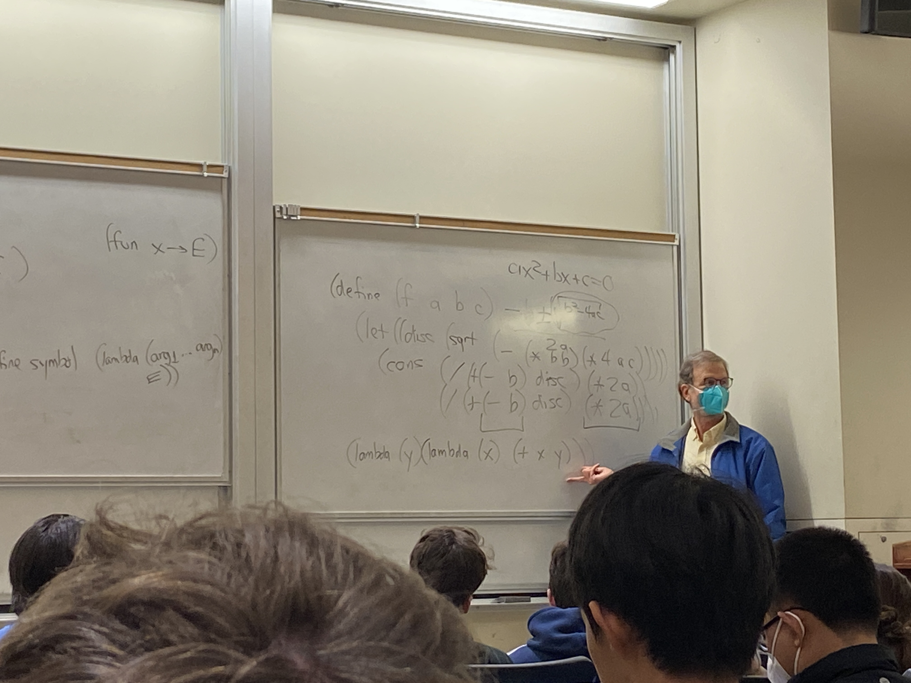

# Lecture 12

## Scheme
- Second oldest language still in use
- (Lisp 1950s Symbolic AI)
- All objects on heap and never freed explicity (bc garbage collector)
- types are latent, not manifest
- static scoping (unlike Lisp)
- call by value
- values include functions (include continuations)
- simple syntax, straightforward way to represent program as data
- tail recursion optimization is required
- "nice" arithmetic, "unlimited" ints, complex numbers, etc.

## Garbage Collection
- simpler code (no clutter)
- no dangling pointers
- no leaks of memory
- (cons)
- cpu time
- less control over memory
- G.C. complexity
- memory

## Dynamic scoping
- static scoping: look at definer, then definer's definer
- dynamic scoping: look @ caller, then caller's caller
- (define (p, f) (let ((y 14) (f (2)))))

```c++
int f(int x) {
    if (x < 0) {
        return 1;
    }
    return mul(f(x-1), 47); // tail call
}
```

```c++
int f(int x) {
    if (x < 0) {
        return 1;
    }
    return f(x-1); // tail call
}
```
- stack doesn't grow on recursion
- looks recursive, but how you use stack, iterative

## Syntax
- Identifiers: a-zA-Z0-9+-.?*/<=>:$%^&_~@
- cannot start with 0-9+-., except + - ->(characters)
  - variables, symbols, keywords
- ; comment
- (l i s t s)
  - uses linked lists 
- (a . b)
  - not linked list
- (a b c . d)
- (a b c)
- (a . (b . (c . ())))
- #(v e c t o r)
- #t, #f
  - x ? y : z
  - (if x y z)
- "string"
- #\c
  - character c
- 12 1e-9 
- 'E is equivalent to (quote E)
```scheme
(let ((p '(if a b)))
    (f p))
```
- `E is equivalent to (quasiquote E)
- ,E is equivalent to (dequote E)
- `` `(a b ,(f x) c, ,y)``

## Operators
- (cons a b)
  - constructs pair with a being first, b being second
  - O(1)
- (car P)
- (cdr P)
  - named after two registers, address and decrement
- (list a b c) equivalent to (cons a (cons b (cons c '())))
- (eq? A B)
  - pointer comparison
  - O(1)
- (eqv? A B)
  - compare contents
- (= A B)
  - (= 0 0.0)
- (equal? A B)
  - recursive equality
  - could be very expensive
- (let ((n (/ 0.0 0.0)) (= n n) (eq? n n)))


## Special Forms
- function calls evaluate all elements before calling
- (if A B C)
- (lambda (x y z) E1 E2 ... En)
- returns value last statement returns
  - if no side effects, only need one E
- f = (lambda (x y . z) E)
  - (f 1 0)
    - x = 1, y = 0, z = ()
  - (f 1 10 'a "x" 12)
    - x = 1, y = 10, z = ('a "x" 12)
- (lambda z E)
  - (f 1 10 'a "x" 12)
    - z = (f 1 10 'a "x" 12)
- (define symbol E)
- (define list (lambda x x))
- (define not (lambda (v) (if v #f #t)))
- (define (symbol arg1 ... argn) E) is equivalent to (define symbol (lambda (arg1 ... argn) E))
- (define (not v) (if v #f #t))
- (let ((v1 E1) (v2 E2) ... (vn En)) E)


- (+) => 0
- (*) => 1
- (let ((a E) (b F)) EXPR) is equivalent to ((lambda (a b) EXPR) E F)
- let vs let*
  - as a series of one argument functions than as one big argument

## Recursion
```scheme
(define (reverse l) 
    (if (eq? l '())
        '()
        (append (reverse (cdr l) (list (car l))))))
```

```scheme
(define (revapp l a)
    (if (eq? l '())
        a
        (revapp (cdr l) (cons (car l) a))))
