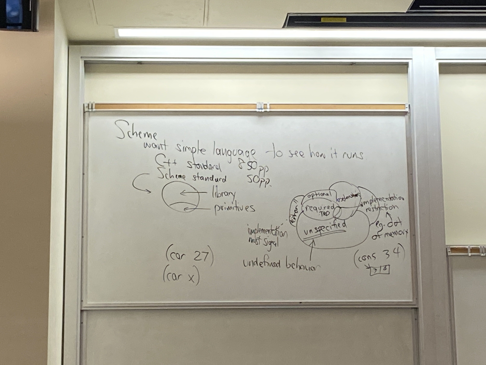
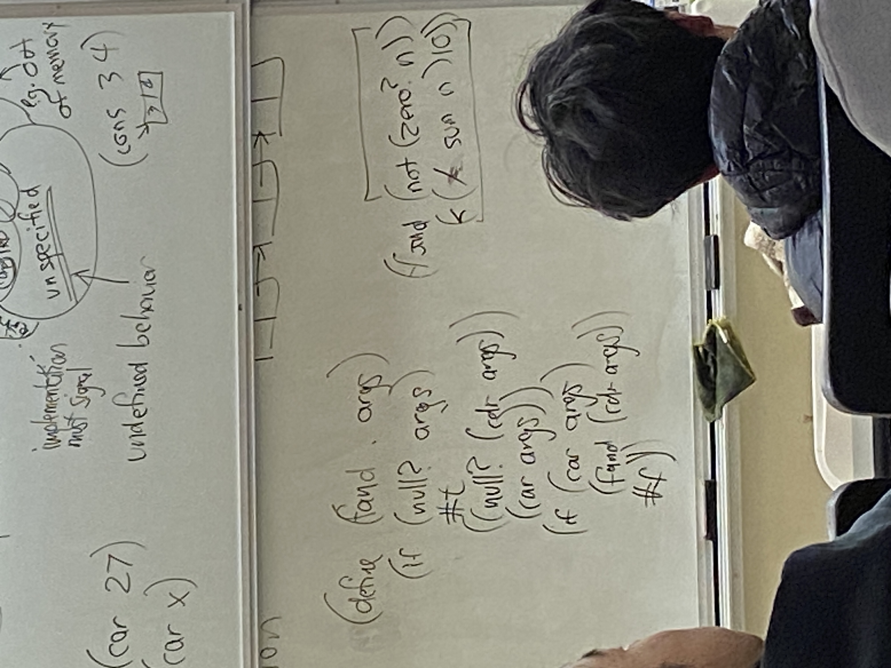
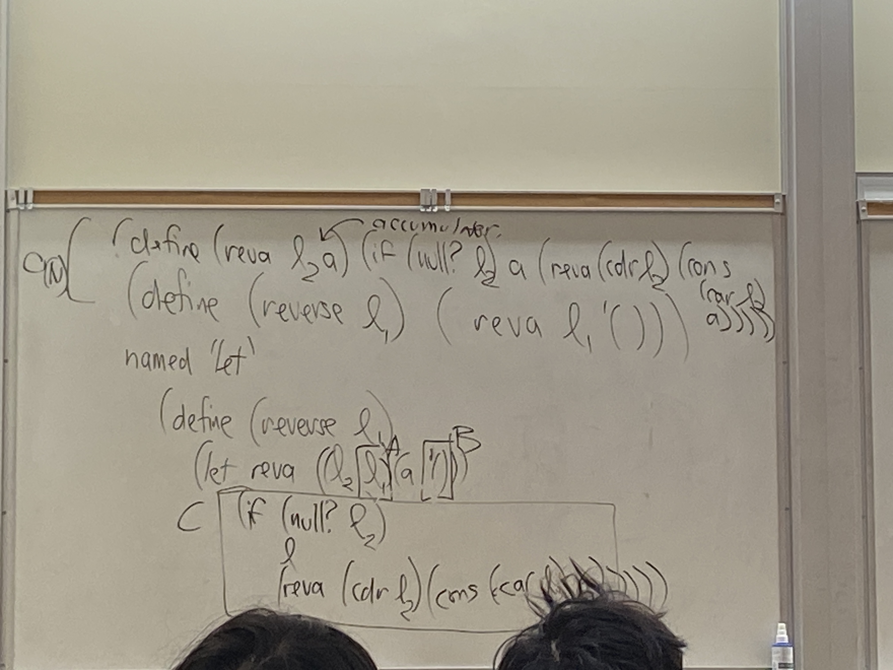
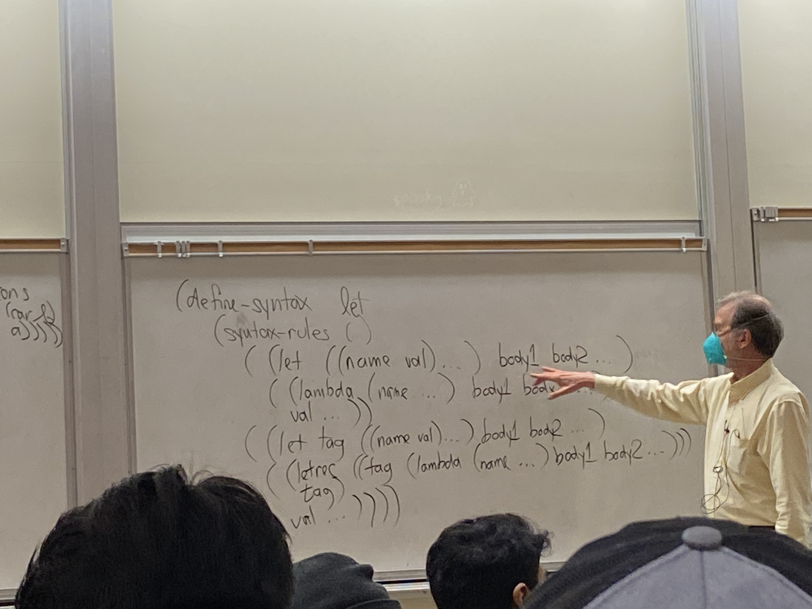

# Lecture 13

## Scheme
- want simple language to see how it runs
- C++ standard: 850 pages
- Scheme standard: 50 pages
- library, primitives
- required, optional, unspecified (undefined behavior), extensions, error
- implementation restriction (e.g. out of memory)
- `(car 27)`
  - stalin would try to treat 27 as pointer to pair, try to find head of pair, crash
- `(car x)`
  - depends on what x is



## Recursion
```scheme
(define (lastpair l)
    (if (or (null? l) (null (cdr l)))
    l
    (lastpair(cdr l))))
(lastpair '(5 1 a b))
```

- recursion with lambda functions??? 

```scheme
(lambda(...) '(5 1 a b))
```

```scheme
(let ((f (lambda (l) (if (or (null? l) (null (cdr l)))
    l
    (f (cdr l)))))))
(f '(5 1 a b))
```

- will NOT work!
- scope of f is different

```scheme
(let ((f (lambda (l f) (if (or (null? l) (null (cdr l)))
    l
    (f (cdr l))))))) 
(f '(5 1 a b) f)
```

- by passing f into f, we bypass the scoping issue
- philosophically, doesn't make sense to define x as itself
- but for functions, rules are different
- core of language is what you can built other functions off of
  - e.g. don't need `define` in scheme

## or and and
```scheme
(or (getenv "PATH") "/bin/usr/bin")
```
- or can return any value you want, not necessarily true and false
  - yields the last true one
- and walks through all the values left to right, yields the last one
- tail recursion
- not part of true core of scheme

## Macros
- `and` is a keyword
```scheme
(define-syntax and (syntax-rules ()
    ((and) #t)
    ((and x) x)
    ((and x1 x2 ...) (if x1 (and x2) #f))
))
```
- change and into if, part of core
- can also define using define, but will evaluate everything before computing


```scheme
(define-syntax or (syntax-rules ()
    ((or) #f)
    ((or x) x)
    ((or x1 x2 ...) (if x1 x1 (or x2) ...))
))
```
- scheme has side effects, so not perfect
  - calls x1 twice, can be expensive
- need something better

```scheme
(define-syntax or (syntax-rules ()
    ((or) #f)
    ((or x) x)
    ((or x1 x2 ...) 
        (let ((v x1)) 
        (if v v (or x2) ...)))
))
```

## Problem of Capture
- cannot change macros to just text
- duplicate variable names
- scheme puts underscores in variable names

## Named let
- used to define internal recursive function

```scheme
(define (reva l a) (if (null? l) a (reva (cdr l) (cons s (car l) a))))
(define (reverse l) (reva l '()))
```

```scheme
(define (reverse l1) 
    (let reva (l2 l1) (a '())) 
        (if (null? l2) 
        a 
        (reva (cdr l2) (cons s (car l2) a))))
```





## Continuations
- every program in every real world language is executed by an interpreter
- has an ip + ep
- ip: instruction pointer
- ep: environment pointer
  - need it for functions
  - basically the stack pointer
- ip is like a to do list
- continuation is data structure

## call-with-current-continuation
```scheme
(call-with-current-continuation p)
```
1. creates a continuation object k representing current interpreter state
   - special object, ip ep pair 
2. (p k)
3. returns whatever (2) returns

(k v)
- transfer control to just after the creator of the continuation
- it returns v

machine level
- rax = 0
- ep = k's ep
- ip = k's ip
- goto (k's ip)

## Faster Multiplication
```scheme
(define (prod ls)
    (call-with-current-continuation
        (lambda (break) 
            (let pr ((ls ls))
                (if (null? ls)
                    1
                    (if (zero? (car ls)) (break 0))
                    (* car ls) (pr cdr ls))))))
```

## setjump
```cpp
#include <setjmp.h>
(type) jmp_buf // equal to continuation (saved regs)
setjmp(j) // create a continuation in j, returns 0
longjmp(j, v) // causes control to transfer back to sethmp, it returns v
```