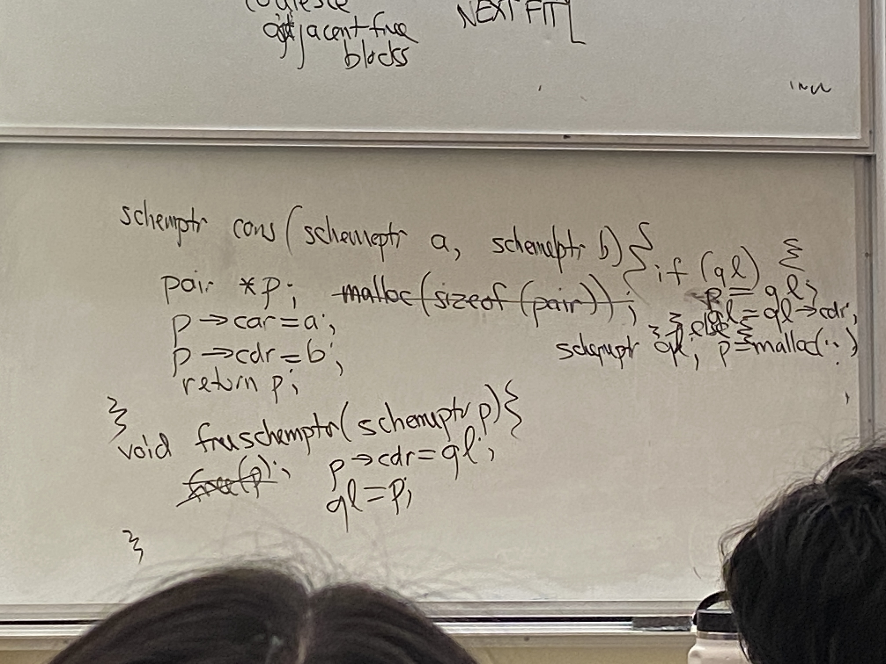

# Lecture 14

## Scheme continuations
- planned future
- jump back into a "returned" function

## Green thread
- single CPO, multiple threads, but at most one runs
```scheme
(define gtlist '()) ;list of "continuations"
(define (gt thunk) ;chunk of code to execute in a g.t. function w no args
    (set! gtlist (append gtlist (list thunk))))
(define (start)
    (let ((next (car gtlist)))
        (set! gtlist (cdr gtlist))
        (next)))
(define (yield)
    (call-with-current-continuation 
        (lambda (k) (gt k) (start))))
(gt (let f () (display "h") (yield) (f)))
(gt (let g () (display "i") (yield) (g)))
(gt (let h () (newline) (yield) (h)))
(start)
; prints the following:
; hi
; hi
; hi
; ...
```
- adds three functions to gtlist
- starts off running f, takes f off of front, adds f to end
- runs g, takes g off of front, adds g to end

```scheme
(define (f x)
    (call/cc
        (lambda (k) (cons k x))))
(let ((y (f 12)))
    (if (pair? y)
        ((car y) 13)
        y))
; yields 13
; the call to f basically returns twice
```

## Memory management
- FORTRAN (1950s)
  - static storage
  - All vars are assigned addresses before execution
  - simple
  - good for machines of 1950s (no index regs)
  - inflexible: program data got big
  - no recursion
- Algol (1960), Lisp (1958)
  - stack storage for local variables
  - recursion
  - problem: performance penalty, stack overflow
  - LIFO
  - stack overflow detection
    - inaccessible virtual memory
```cpp
int f(int n) {
    double a[n];
    double b[n+3];
}
```
- C (1977)
  - recursion
  - stack
  - fixed-size frame (activation registers)
- C99 (variable length arrays)
- C11 (options)

## Nested functions
```cpp
int f(int x) {
    int g(int y) {
        return x + y;
    }
}
```
- y is in rdi, but x is hard to find

## Dynamic chain
- linked list of activation records, ending in top level
- tells you where to go after return
- points to the caller's frame

## Static chain
- points to definer's frame
- e.g. g's definer is f
- top level, definer's frame is nullptr
- with nested functions, need 2 pointers for function
  - one for code, one for caller/definer
  - looks like a continuation

```scheme
(define f 
    (lambda (x)
        (lambda (y) (+ x y))))
(define x (f 12))
```
- x is an ip, ep pair, where ip points to code that adds the two numbers
- ep points to f's frame
  - however, f has returned, so ep is a dangling pointer
- traditional answer is don't do this
- it is ok in scheme
- some frames live on the heap in scheme: currying
  - only when functions define other functions
- garbage collection

## Memory Management
- static: $\infty$
- stack: LIFO
- heap: LIAO (last in any out)

## C-style heap, explicit allocate, free
- `malloc(1000)`
- free list: linked list of descriptions of free blocks
- first fit: find first block that is big enough, carve out 1000 bytes, update free list
- free list in free blocks
- roving ptr (next fit): have circular list, move up the free list pointer
- free
  - coalesce
  - adjacent free blocks
    - have markers at edges of free blocks
```cpp
schemeptr cons(schemeptr a, schemeptr b) {
    pair *p = malloc(sizeof (pair));
    p->car = a;
    p->cdr = b;
    return p;
}
void freeschemeptr(schemeptr p) {
    free(p);
}
```
- slow! instead:


## Garbage collection
- no dangling ptrs
- fewer memory leaks
  - still possible!
- complex
- CPU time, RAM
- garbage collector must know 
  - location of roots
  - object layout
    - where pointers on stack and static are, to see if there's still pointers pointing to heap data

## Mark + sweep algorithm
- next time