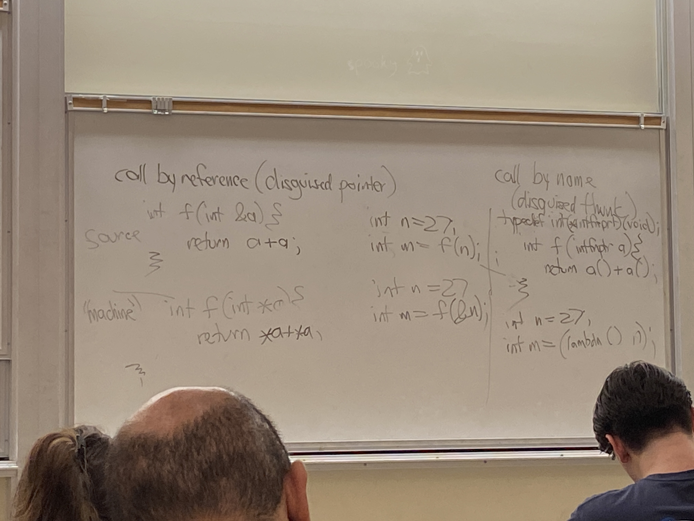

# Lecture 16

## Parameter passing
- call by value
  - "eager evaluation"
    - evaluate before needed
- call by reference
  - original Fortran, everything call by reference
  - aliasing, confusion
    - (a is 10)
    - a = a+1
    - b = b+1
    - (a is 12)
- call by value-result optimization
  - Ada = call by value + call by result
    - call by result is able to return more than 1 value
```ada
int f(int a, result int b) {
    int c;
    b = 12;
}
```
  - expensive, copies twice
- call by name
  - call by reference means disguised pointer
  - while call by name is a disguised func
  - 
  - has a performance penalty
  - for each loop, have to call the function every time because it might be different
  - less popular than call by need
  - aka "lazy evaluation"
```
printarg(int arg, int n) {
    if (n == 0)
        print("***")
    else
        printf("%19d\n", arg)
}
printarg(sum/n, n)
```
  - doesn't crash for call by name
- call by need
  - call by name + cache result
  - almost as fast as call by name
- macro calls (hygenic or not?)
- call by unification
- Python, as with most modern languages, uses a hybrid

## Errors
- fault vs failure vs error
- error - mental mistake by program author
- fault - latent bug in your program
- failure - when fault gets exercised and user notices
- focus on failure
- other ways to deal with errors
  - static checking (OCaml type checking)
  - preconditions
    - e.g. sqrt(double x) precondition (x >= 0)
  - special values to represent errors
    - getchar() return EOF on error
  - failures are fatal
  - undefined behavior
    - INT_MAX + 1
    - gcc -fsanitize=undefined
  - exception handling

## Exception handling
```
try {
  normal code
} catch (IOexception e) {
  fix IOexceptions
} finally {
  always executed
}
```
- this exception handling code encourages bad programming
- many gotos and continuations in try block
- thrower's frame finds catcher's frame on stack
- can catch all exceptions, but bad if just using to get rid of errors

## Java checked exceptions
- each method's signature includes exceptions it can throw
- static checking that all exceptions are caught
- exception class Java form a tree
- Throwable
- out of memory (oom)

## Cost models
- mental model for cost of execution
  - O(N) vs O(N^2)
- what costs?
  - CPU time
  - real time
  - RAM consuption
  - network access
  - executable size
  - power, energy
  - filesystem space
- example: lists
  - ocaml: linked lists
  - scheme: append(X, Y)
  - Python l[n] O(1)
- call a function
  - evaluate args
  - copy values into registers/stack
  - push r.a.
  - jmp f
  - allocate frame
  - save regs
  - work
  - save returned value into %rax
  - restore saved regs
  - deallocate frame
  - pop r.a.
  - jmp back
  - look at rax
- after optimizations
  - tail recursion optimization
  - inlining
- after skipping: 
  - evaluate args
  - work
  - save returned value into %rax
  - restore saved regs
  - look at rax
- another place to save cost: array indexing
  - array descriptors / fatter pointers
  - use strides
