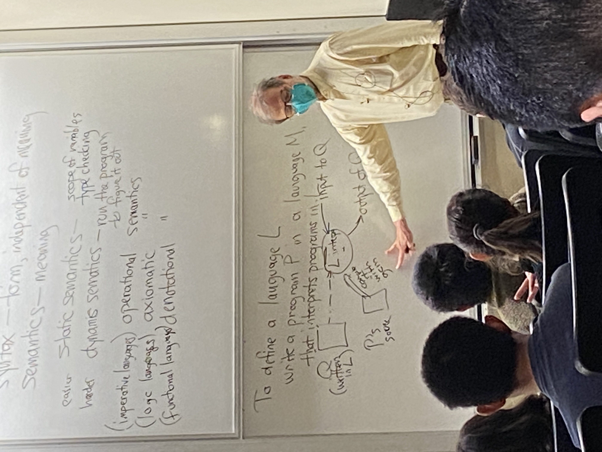
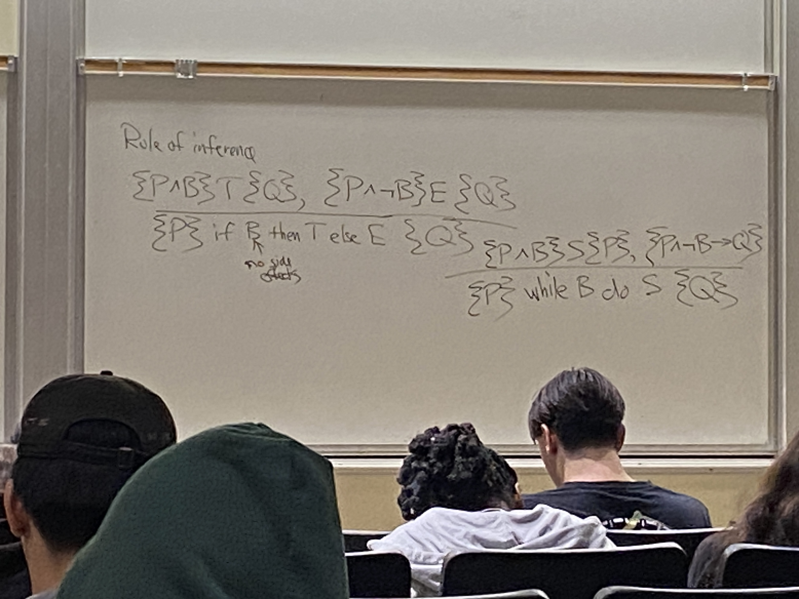

# Lecture 17

## What does a program mean?
```cpp
char buf[6];
snprintf(buf, sizeof buf, "%s", "hello")
snprintf(buf, INT_MAX, "%s", "hello")
```

## Syntax vs Semantics
- sytax - form, independent of meaning
- semantics - meaning
  - static semantics - scope of variable, type checking
  - dynamic semantics - run the program to figure it out

## Attribute Grammars
- D.E. Knuth
- generate parse tree
- symbol table
- attributes can flow both down and up
  - e.g. type flows up
- attributed parse tree
- e.g. expr1 = expr2 * expr3
  - type (expr1) = if type(expr2) = 'int' & type(expr3) = 'int' then 'int' else 'float'
- e.g. block -> {decl stmt}
  - symtab(stmt) = symtab block symtab decl

## Dynamic semantics
- operational (imperative)
- axiomatic (logic)
- denotational (functional)

- to define a language L,
  - write a program P in a language M that interprets programs in L


## Operational semantics for ML in Prolog
- eval(E, C, R)
- E is expr
  - parse tree
- C is context
  - like variables
- R is resulting value
```prolog
eval(I, _, I) :- integer(I).
eval(E1+E2, C, R) :- eval(E1, C, R1), eval(E2, C, R2), R is R1 + R2.
?- eval(5+7+12, [], R).
R=24
```
- the two +'s are different, one is syntactic, one is semantic
```prolog
eval(n, [n=19, n=12, p=13], 12)
```
```prolog
eval(let(v, E1, E2), C, R) :- eval(E1, C, R1), eval(E2, [V=R1|C], R).
```
```prolog
eval(let(a, b+c, a*a), [b=1, c=3], R) :- 
    subgoal eval(b+c, [b=1, c=3], R1) (R1 = 4),
    eval(a*a, [a=4, b=1, c=3], R) (R = 16).
```
```prolog
eval(fun(X, E), C, λ(X, E)).
eval(call(E1, E2), C, R) :- 
    eval(E1, C, λ(X, E1)),
    eval(E2, C, R2),
    eval(E1, [X=R2|C], R).
```
- this code actually does dynamic scoping!
- switch to static scoping: add contect to expressions

### Aside: how to represent ML functions in Prolog?
- `fun x -> E`
- `fun(X, E)`

## Axiomatic semantics
- {P} S {Q}
- If P is true before you execute S, and S runs and finishes, then Q is the afterwards
- {y = y_0} x = sqrt(y), {x^2 = y_0}
- {x+1 < 0} x++, {x < 0}

## Rule of inference
- {P or B} T {Q}, {P or not B} E {Q}


## Denotational semantics
- M(P) function from inputs to outputs
- E(E) = function from program state to value

## History of Programming Languages
- Fortran (1956)
  - arrays
  - loops
  - subroutines
  - IBM Backus
- Algol (1960)
  - reaction to Fortran
  - BNF
- Lisp (1959)
  - recursion
  - S-expr
- Cobol (1960)
  - struct
- PL/I
  - kitchen sink
- C++
- Smalltalk
- Java